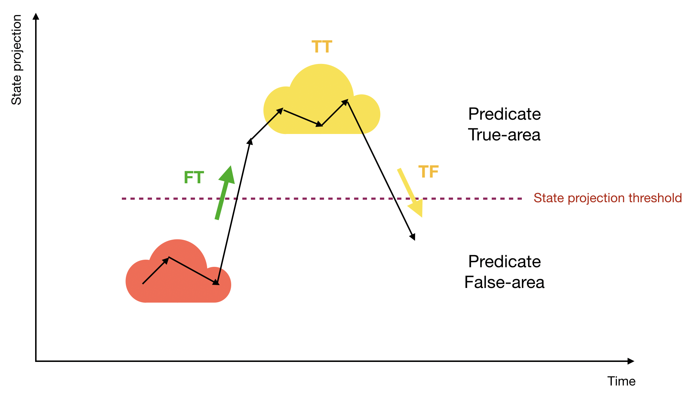

# AsyncFlow

**async-flow** is an easy to use js module organizing multiple async tasks
into a queue to be run one at a time. Via its API you can:
- manage running state of a queue
- pass values between tasks in a queue
- handle errors
- automatically rerun task if/when needed
- merge a newly added task with an existing one
- and so on

## Simplest example

```javascript
// first of all we create the flow,
// which is launched in the PAUSED state
// and should be started by the start() call.

const flow = createAsyncFlow({name: 'example'});
flow.addTask(new AFTask({func: yourAsyncFunc1}));
flow.addTask(new AFTask({func: yourAsyncFunc2}));
flow.start();

// new tasks can be added to the end of the flow at any time
// and at any point in the application

flow.addTask(new AFTask({func: yourAsyncFunc3}));

// if you don't need/want to customize tasks by passing callbacks
// like onSuccess, onError, or onErrorPolicy, etc. (see AFTask.constructor()),
// you can simply pass addTask a function, like so:

flow.addTask(yourAsyncFunc4);

```

## Using task results in other tasks

The first task in the flow receives the `initValue` as a parameter that's passed to `createAsyncFlow()` function. Every subsequent task function then receives the last successfully evaluated result of the previously queued task as its parameter.


```javascript
// let's start with a small handy snippet
class SymbolTask extends AFTask {
  constructor({symbol}) {
    super({func: async (string) => {
      return string + symbol;
    }});
  }
}
// and call it several times, adding it to the flow
const flow = createAsyncFlow({name: 'pass', initValue: ''});
flow.start();
flow.addTask(new SymbolTask('a'));
flow.addTask(new SymbolTask('b'));
flow.addTask(new SymbolTask('c'));

// so now, after all the tasks are done,
// current value of flow is 'abc'
console.log(flow.getCurrentValue());
```

## Detecting when all tasks are done

You can add / remove a listener and trigger a callback when the flow becomes empty - basically when all tasks are done. AsyncFlow's *addFlowIsEmptyListener()* and *removeFlowIsEmptyListener()* methods do just that:

```javascript
flow.addFlowIsEmptyListener(({result, hasScheduledTasks}) => {
  if (!hasScheduledTasks) {
    // Do something
  }
});
```

In the example above *result* is the current value of the flow,
while *hasScheduleTasks* is a boolean set to `true` if there are tasks
scheduled to be re-added into the queue after an error.

## onSuccess & onError callbacks

The *onSuccess* and *onError* callbacks can be used, as it is implied by their names, to handle certain task success / fail scenarios, for example:

```javascript
function onTaskSuccess({result, taskId}) {

}

function onTaskError({error, taskId}) {

}

flow.addTask(new AFTask({
  func: myFunc,
  id: 'myTask',
  onSuccess: onTaskSuccess,
  onError: onTaskError
}))
```

## RunningState

Right after it's creation, a flow is in the RunningState.PAUSED, which means
no tasks are running. You can use the *start()* method to run the flow,
*pause()* method to return it back to the PAUSED state, or *stop()* to stop
the flow completely.

After *stop()* is called, the flow can't be rerun and throws an exception on any attempts to change its state.

Current running state can be found with *getRunningState()*
which returns one of RunningState values:

```javascript
const RunningState = Object.freeze({
  PAUSED: 0,
  RUNNING: 1,
  STOPPED: 2,
  GOING_TO_PAUSE: 3
});
```

## Errors handling

If an exception is thrown by the task currently being processed, by default, a flow will interrupt its work by going into the STOPPED state.

The default behavior can be changed using the *onErrorPolicy* parameter. Please note that it can be passed to the *createAsyncFlow()* function as well as to the constructor of AFTask. Task policy has priority over flow policy.

OnErrorPolicy object looks like this:

```javascript
{
  action: OnErrorAction,
  attempts: number,
  delay: number | function    
}
```

**attempts** (max attempts counter) is optional and by default is 1

**delay** (delay in ms to rerun a task after exception) is optional
and makes sense for RETRY actions only (see below). If no value is passed, the flow will retry immediately.

**action** is required and can be:

```javascript
const OnErrorAction = Object.freeze({
  STOP: 0,              // flow will be stopped after exception

  PAUSE: 1,             // flow will be paused after exception

  RETRY_FIRST: 2,       // flow will rerun the task that threw the exception,
                        // task will be added to flow head

  RETRY_LAST: 3,        // flow will rerun the task that threw the exception,
                        // task will be added to flow tail

  RETRY_AFTER_PAUSE: 4, // flow will be paused for a delay in ms,
                        // and after that the task will be rerun

  CONTINUE: 5           // flow will continue to the next task
});

```

In the example below the flow will be stopped if all retry attempts fail:

```javascript
let delay = 100;
const flow = createAsyncFlow({
  name: 'flow',
  initValue: '',
  onErrorPolicy: {
    action: OnErrorAction.RETRY_AFTER_PAUSE, attempts: 3, delay: () => {
      delay *= 2;
      return delay;
    }
  }
});

```

## Repeating tasks

If you need to schedule a repeating task you can pass repeatingInterval to the task constructor:

```javascript
const task = new IncTask({repeatingInterval: 20});
```

Please note that `repeatingInterval` defines interval in ms between the task finish time and time when it's re-added to the flow queue.

## Canceling tasks

A task can be canceled by the `AsyncFlow.cancel(task)` method call.

## Flow state

Sometimes you might want to be notified about some specific state changes in the flow.
Maybe you're getting external values from a sensor, or some data from a server, or there's a lot of errors being thrown when flow is running and you need to look more into it.

For scenarios like that this API provides a flow state listening mechanism.

Every flow has an internal object `_flowState`, that can be read by the `getFlowState()` function and is set by `setFlowState(newState)`.

You can add a state listener to be notified when a specific condition is true:

```javascript
flow.addStateListener(predicate, listener);
```

where `predicate` is a function receiving state parameter and returning a boolean or an object
```javascript
{
  result: boolean,
  data: object
}
```

and **listener** is a function receiving {state, data} as a parameter.

For example:

```javascript
flow.addStateListener((state) => state.a > 2, ({state}) => {
  console.log(`state.a = ${state.a}`);
});
```

In the example above the listener will be called when state.a > 2. Please note that AsyncFlow notifies
state listeners between tasks, not during the setState() call.
Every state listener is be called (if predicate is true) until it is removed from the AsyncFlow
by `removeStateListener(listener)`.

You can also use the `await` syntax to wait for a specific state condition. Just call `promiseForState()`, for example:

```javascript
const {state} = await flow.promiseForState((state) => state.a > 2);
```

## Flow state projection

Though you can follow the flow state with state listeners described above, there is also another special mechanism in AsyncFlow.

Say you need to be notified when some state-based function (let's call it *state projection*
or just *projection*) passes a threshold.



The figure above illustrates an example of a state projection value evolution over time.
The projection threshold is set by predicate function that separates all the
area of projection values into two parts: True-area and False-area. We definitely
want to know when projection will exceed threshold, i.e. when there will be transition
from False to True-area (FT).
Sometimes we'd like to also know about back transition from True to False-area (TF).
Finally, sometimes we might need to be notified on every projection value change while it
happens in True-area.

AsyncFlow provides the following method
```javascript
addStateProjListener(projection, predicate, listener, flags)
```

where **projection** is a function receiving flow state as a parameter and returning some `projectionValue` and

**predicate** is a function receiving `projectionValue` parameter and returning a boolean or an object.

```javascript
{
    result: boolean,
    data: object
}
```

**listener** is a function receiving `{state, data}` as a parameter,

and **flags** is optional and describes if a listener is called on True->True and True->False moves. It can be constructed using *AsyncFlow.StateProjJump.TT* and
*AsyncFlow.StateProjJump.TF* constants, as we see in the code example below:

```javascript
flow.addStateProjListener(
  (state) => state.a,
  (a) => a > 2,
  listener,
  AsyncFlow.StateProjJump.TT | AsyncFlow.StateProjJump.TF);
```

The listener will be called on every FT, TT and TF change of projection.
The projection is evaluated as *state.a*, predicate receives this projection
value and returns *a > 2*.

## Tasks merging

In some cases you might not want to add a new task if the same task is already waiting in the queue to be run, you might just want to add some listeners to an existing task. Or maybe you want to replace an existing task by merging it with a new task. You can use the merging mechanism of AsyncFlow to achieve just that.

Let's start with a very simple example:

```javascript
class SymbolTask extends AFTask {
  constructor({symbol}) {
    super({
      func: async (string) => {
        return string + symbol;
      },
      merger: AFTaskMerger.BASIC
    });

    this.symbol = symbol;
  }

  isTaskEqual(task) {
    return this.symbol === task.symbol;
  }
}

// we create flow that supports merging
const flow = createAsyncFlow({name: 'flow', mergingPolicy: MergingPolicy.HEAD});

flow.addFlowIsEmptyListener(({result}) => {
  console.log(result);
  // it logs 'abc' because last added task is merged with the existing one
});


flow.addTask(new SymbolTask({symbol: 'a'}));
flow.addTask(new SymbolTask({symbol: 'b'}));
flow.addTask(new SymbolTask({symbol: 'c'}));
flow.addTask(new SymbolTask({symbol: 'b'}));
flow.start();
```

First of all we need to create a flow that supports merging by passing a merging policy object to `createAsyncFlow()` that's something else than `NONE` (default). It can be

```javascript
const MergingPolicy = Object.freeze({
  NONE: 0, // merging is off
  HEAD: 1, // looking for the task to merge to at the head of queue
  TAIL: 2  // try to merge to last task in the queue only
});
```

Both tasks we're merging together have to support merging; it means they have to have something else then `NONE` set as a constructor parameter. In the current version of
AsyncFlow it can be either `AFTaskMerger.BASIC` or some custom method taking task as a parameter and returning a merged task as result.

A BASIC merger, illustrated in the example above, will ignore a newly added task if there's already an identical task in the queue (see the *isTaksEqual()* method in example code).

It also adds onSuccess and onError of the new task to the existing one.

## Task priority

By default every new task is added to the end of the AsyncFlow queue because all tasks have the same (AFTaskPriority.NORMAL) priority. The task priority can be set either via constructor or by task.priority assignment. The value of priority should be numerical. You can use some predefined constants to make your code more readable:

```javascript
const AFTaskPriority = Object.freeze({
  HIGHEST: 0,
  HIGH: 64,
  NORMAL: 128,
  LOW: 192,
  LOWEST: 255
});
```

Please note that BASIC merger chooses the highest priority (i.e. minimal value) from merged task priorities. This means that if there is a `task1` in queue with priority `NORMAL` and you add a new `task2` with priority `HIGH` then the merged task will have the priority set to `HIGH` and will be
moved closer to the head of the queue.

## await syntax

As you've already seen above you can use *onSuccess()* and *onError()* callbacks with flow tasks.
Alternatively you also have an option of using a different syntax - **await**, because *addTask()* method returns a promise.
It should be taken into account though that there are some cases when AsyncFlow restarts the task by itself: it is true for repeating tasks and for some cases of handling onErrorPolices.
That's why the most general form of `await` usage is:

```javascript
let currentPromise = flow.addTask(task);
while (currentPromise) {
  try {
    const {result, currentPromise: promise} = (await currentPromise).throwOnError({throwIfCanceled: true});
    // we do something useful with the result here
  } catch (e) {
    currentPromise = e.promise;
  }
}
```

## AFManager

AFManager provides a method to resolve the created AsyncFlow by its name.
For example:

```javascript
global.afManager = createAFManager();

createAsyncFlow({name: 'flow1', afManager});

createAsyncFlow({name: 'flow2', afManager});

```

Now you can easily get flow1 and flow2 from any part of your application:

```javascript
const flow = global.afManager.resolve('flow1');
```

Please note that it's not possible to add a second AsyncFlow of the same name to the same AFManager, you'll get an error in that case.
